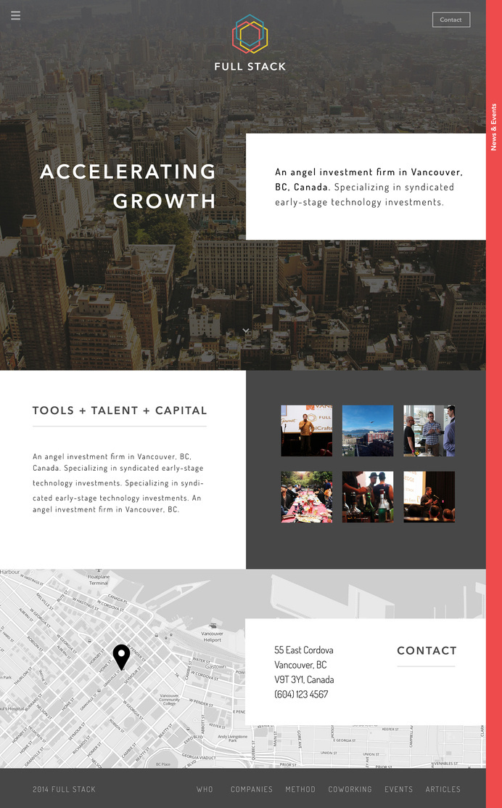
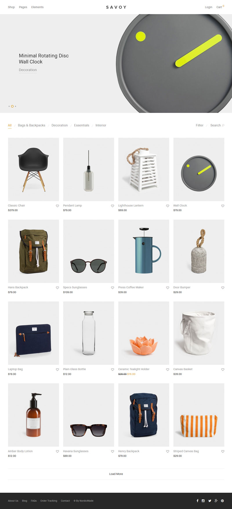
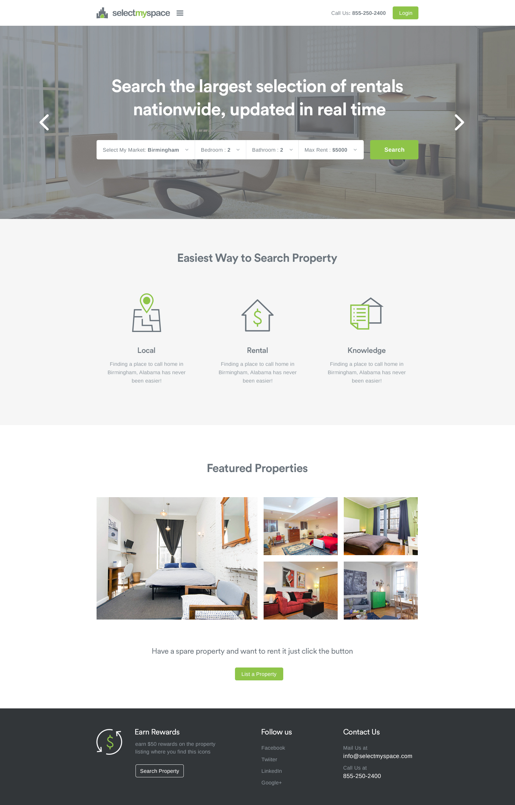
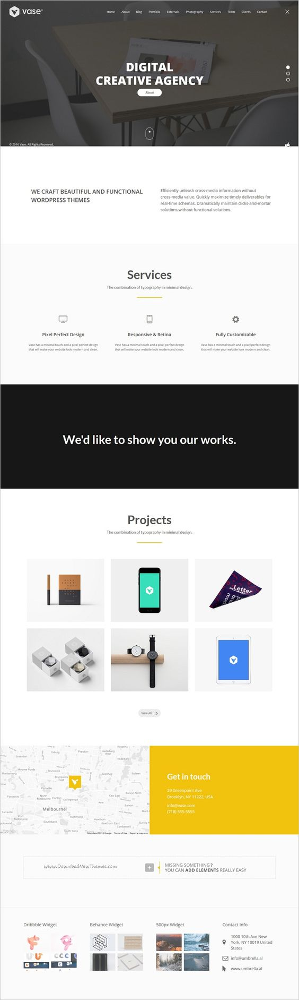
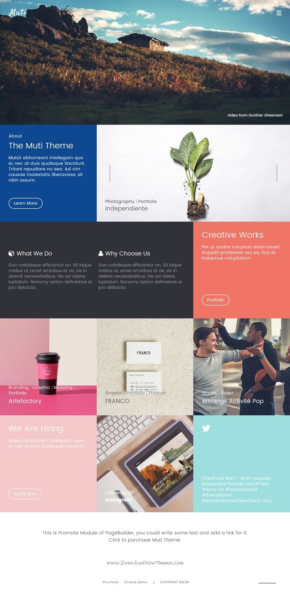
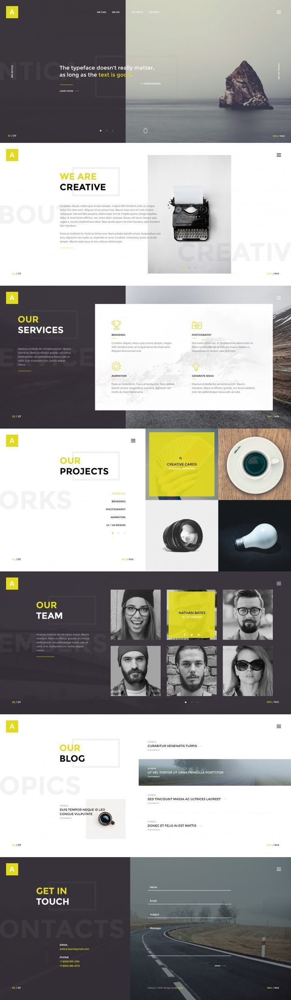

# Layouts
Haz el maquetado de cada una de las imágenes a continuación utilizando tus conocimientos de HTML y CSS, los layouts van aumentando de dificultad por lo que te recomiendo que los desarrolles en orden.
1. [Hero/Info/Contact]
2. Ecommerce Frontpage
3. Power Up Hero/Icons/Gallery
4. Digital Creative Agency Frontpage
5. Multi Purpose Frontpage
6. Single Page Site

## Hero/Info/Contact

## Ecommerce Frontpage

## Power Up Hero/Icons/Gallery

## Digital Creative Agency Frontpage

## Multi Purpose Frontpage

## Single Page Site

